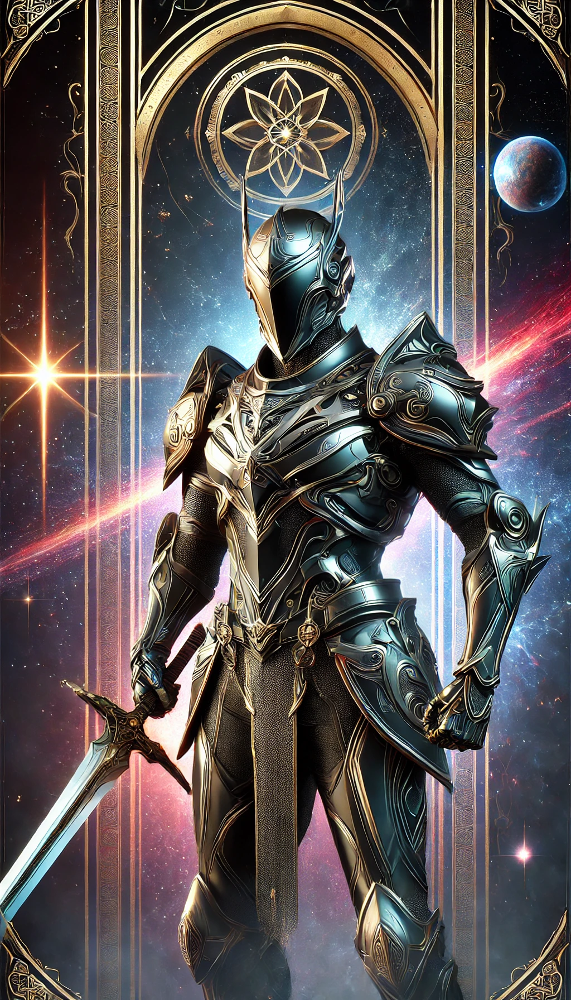

<h1 align="center" width="100%">
     
    
     
    Aliança da Supernova
     
</h1>

<h4 align="center">
    Repositório da Aliança da Supernova para o curso de Aprendizado de Máquina do professor Daniel Cassar.
</h4>

  
  
  

  <a href="#Sobre-o-Projeto">📝 Sobre</a> •
  <a href="#Estrutura-do-Repositório">🚧 Estrutura</a> •
  <a href="#Personagens-Principais">🧙🏼‍♂️ Personagens</a> •
  <a href="#Filosofia-da-Aliança">🪨 Filosofia</a>

## 📝 Sobre o Projeto

 

Este repositório contém as quests realizadas pela **Aliança da Supernova** no curso de Aprendizado de Máquina do professor **Daniel Cassar**. A **Aliança da Supernova** é composta pelos cavaleiros **Tsuru**, **Pólux**, e **Tiles**, que, após a injustiça sofrida por **Castor**, irmão gêmeo de Pólux, decidiram se rebelar contra a filosofia da **União Total**. Este repositório reflete suas jornadas
em busca de uma revolução, em que cada indivíduo é valorizado por suas habilidades únicas.

## 🚧 Estrutura do Repositório

- <a href="https://github.com/JuliaGuedesASantos/Machine-Learning---Cavaleiros-da-Supernova/tree/main/Mural%20da%20Taverna%20do%20Sol%20-%20Quests%201">☀️ Quests 1<a>: Início da jornada da Aliança da Supernova, com a resolução de problemas de familiarização com datasets, visualização de dados, normalização e algortimos de classificação.
- <a href="https://github.com/JuliaGuedesASantos/Machine-Learning---Cavaleiros-da-Supernova/tree/main/Mural%20da%20Pra%C3%A7a%20da%20Fonte%20-%20Quests%202">⛲ Quests 2</a>:
- <a href="https://github.com/JuliaGuedesASantos/Machine-Learning---Cavaleiros-da-Supernova/tree/main/Mural%20da%20Biblioteca%20Real%20-%20Quests%203">📚 Quests 3</a>:
- <a href="https://github.com/JuliaGuedesASantos/Machine-Learning---Cavaleiros-da-Supernova/tree/main/Criatura%20Lend%C3%A1ria%20">🐲 Criatura Lendária</a>: A temida batalha contra o dragão! A Aliança da Supernova encontra seu mais temido inimigo em uma batalha um tanto quanto desafiadora: será necessária a ajuda de todos os aliados angariados no decorrer de sua joranada, além disso, os guerreiros precisarão de todo o conhecimento adquirido nos entraves anteriores se quiserem combater essa criatura e proteger o reino de Lumi. Acesse a este diretório para encontrar essa batalha épica: o assombroso projeto final da disciplina.

Cada diretório contém os scripts, códigos, e arquivos necessários para a resolução das quests.

## 🧙🏼‍♂️ Personagens Principais

### Tsuru

Cavaleiro da Supernova, especialista em táticas de combate.

---

### Pólux

Irmã de Castor, cavaleira exímia que luta por um sistema mais justo e igualitário.

---

### Tiles

Mestre estrategista e defensor das ideias revolucionárias, aliado de Tsuru e Pólux.

## 🪨 Filosofia da Aliança

A **Aliança da Supernova** busca a reestruturação da organização dos cavaleiros no império, para que cada um possa usar suas habilidades únicas de forma eficaz e satisfatória para a proteção de **Lumi**.

## 📜 Referências

A *Aliança da Supernova* reconhece os anciãos e seus manuscritos repletos de conhecimento sem os quais a jornada teria sido extremamente árdua e, com certeza, menos satisfatória. Nesse sentido, abaixo, encontram-se listados os pergaminhos que foram essenciais para concluir as aventuras sobreditas e, sobretudo, derrotar o dragão que assolava Lumi.

**Bibliotecas**:

[1] Pandas. Versão 2.2.2. Disponível em: https://pandas.pydata.org/.

[2] Scikit-learn. Versão 1.5.1. Disponível em: https://scikit-learn.org/.

[3] Statistics. Versão 1.0.3.5. Disponível em: https://docs.python.org/3/library/statistics.html.

[4] os. Disponível em: https://docs.python.org/3/library/os.html.

[5] Seaborn. Versão 0.13.2.Disponível em: https://seaborn.pydata.org/.

[6] Matplotlib. Versão 3.9.1. Disponível em: https://matplotlib.org/.

[7] Plotly. Versão 5.24.1. Disponível em: https://plotly.com/python/.

[8] Numpy. Versão 2.0.0. Disponível em: https://numpy.org/.

[9] Optuna. Versão 4.0.0. Disponível em: https://optuna.org/.

[10] Graphviz. Versão 0.20.3. Disponível em: https://graphviz.gitlab.io/.

[11] Scipy. Versão 1.14.0. Disponível em: https://www.scipy.org/.

**Bibliografia - Criatura Lendária**:
[1]

**Bibliografia - Quests**:

[1] Cassar, Daniel Roberto - Materiais de aula das disciplinas de Aprendizado de Máquina (ATP 203) e de Probabilidade e Estatística (LMA 203). Os notebooks consultados encontram-se listados a seguir: *1.1 - Tratamento de dados*; *2.1 - Aprendizado de máquina*, *k-NN e métricas*; *3.0 - Modelo linear e baseline*; *4.0 - Split de dados de treino e teste*; *4.1 - Árvore de decisão*; *5.0 - Validação cruzada, busca aleatória e busca em grade*; *5.1 - Floresta aleatória*; *6.1 - Otimização de hiperparâmetros com optuna*; *7.0 - Dados sintéticos e pipeline*; *7.1 - Seleção de atributos*; *8.0 - A matrix de covariância e a matriz de correlação*; *8.1 - Redução de dimensionalidade com PCA*.

###### Quests 1

[2] Fácil, Aprender Estatística. “O que é: Standard Normal Distribution (Distribuição Normal Padrão)”. APRENDER ESTATÍSTICA FÁCIL, 26 de julho de 2024, https://estatisticafacil.org/glossario/o-que-e-standard-normal-distribution-distribuicao-normal-padrao/.

[3] “Seaborn Datasets For Data Science”. GeeksforGeeks, 27 de maio de 2024, https://www.geeksforgeeks.org/seaborn-datasets-for-data-science/.

[4] “Prêmio de seguro: saiba o que é e como funciona”. Mais Retorno, 6 de novembro de 2019, https://maisretorno.com/portal/termos/p/premio-de-seguro.

[5] Şenol, Ömer. “Seaborn:Datasets’s Explorations”. Medium, 21 de dezembro de 2020, https://senolomer0.medium.com/seaborn-datasetss-explorations-39d080e55e55.

[6] “O Que Significa a Cilindrada do Motor e no Que Ela Influencia?” Blog Unidas Seminovos, 16 de maio de 2017, https://seminovos.unidas.com.br/blog/cilindrada-do-motor/.

[7] Github do Seaborn. https://github.com/mwaskom/seaborn-data?tab=readme-ov-file.

###### Quests 2

[8] "TLC Trip Record Data". New York City Taxi and Limousine Commission (TLC), 09 de agosto de 2017, https://www.nyc.gov/site/tlc/about/tlc-trip-record-data.page.

[9] "Itertools — Functions creating iterators for efficient looping", Python 3 Documentation. Disponível em: https://docs.python.org/3/library/itertools.html

[10] "Itertools in Python 3, By Example", Real Python. Disponível em: https://realpython.com/python-itertools/

[11] "Lazy evaluation", Wikipedia. Disponível em: https://en.wikipedia.org/wiki/Lazy_evaluation

[12] "Itertools in Python", GeeksforGeeks. Disponível em: https://www.geeksforgeeks.org/python-itertools/

[13] A data-driven statistical model for predicting the critical temperature of a superconductor. https://archive.ics.uci.edu/dataset/464/superconductivty+data

[14] “1.5. Stochastic Gradient Descent”. Scikit-Learn, https://scikit-learn/stable/modules/sgd.html. Acesso em 20 de setembro de 2024.

[15] “Stochastic Gradient Descent Regressor”. GeeksforGeeks, 30 de outubro de 2023, https://www.geeksforgeeks.org/stochastic-gradient-descent-regressor/.

[16] "Stochastic gradient descent". WikiPedia, https://en.wikipedia.org/wiki/Stochastic_gradient_descent. Acesso em 20 de setembro de 2024.

[17] "Stochastic gradient descent vs Gradient descent — Exploring the differences", Medium, Seshu Kumar Vungarala. https://medium.com/@seshu8hachi/stochastic-gradient-descent-vs-gradient-descent-exploring-the-differences-9c29698b3a9b. Acesso em 20 de Setembro de 2024.

[18] "Bar Charts in Python". https://plotly.com/python/bar-charts/

[19] Dataset supercondutividade: https://archive.ics.uci.edu/dataset/464/superconductivty+data.

[20] HAMIDIEH, K. A data-driven statistical model for predicting the critical temperature of a superconductor. Computational Materials Science, v. 154, p. 346–354, nov. 2018.

‌[21] Supercondutividade - Conceitos básicos: https://edisciplinas.usp.br/pluginfile.php/8274184/mod_resource/content/0/1%20-%20Base%20de%20Supercondutividade%20I.pdf.

[22] A TEORIA BCS DA SUPERCONDUTIVIDADE. [s.l: s.n.]. Disponível em: https://www2.ufjf.br/rodrigo_dias/wp-content/uploads/sites/480/2022/01/A-TEORIA-BCS-DA-SUPERCONDUTIVIDADE.pdf. Acesso em: 22 de setembro de 2024.

[23] Jupyter Notebooks: Dicas de Formatação - BRAINS. 30 de dezembro de 2022, https://brains.dev/2022/jupyter-notebooks-dicas-de-formatacao/.

[24] “KNeighborsClassifier”. Scikit-Learn, https://scikit-learn/stable/modules/generated/sklearn.neighbors.KNeighborsClassifier.html. Acesso em 7 de setembro de 2024.

[25] Pinto, Ricardo. “Entendendo Porque é Que a Distância Certa Faz Toda a Diferença”. Data Hackers, 24 de agosto de 2020, https://medium.com/data-hackers/entendendo-porque-%C3%A9-que-a-dist%C3%A2ncia-certa-faz-toda-a-diferen%C3%A7a-648030c9bae2.

[26] Eduardo, José. “Distâncias - 3 mais usadas em IA”. Blog, 13 de dezembro de 2022, https://www.meuguru.com/blog/distancia-3-mais-usadas/.

[27] Arcanjo, Jonys. “Maldição Da Dimensionalidade”. Data Hackers, 25 de setembro de 2022, https://medium.com/data-hackers/maldi%C3%A7%C3%A3o-da-dimensionalidade-655e4342d64.

[28] seaborn.load_dataset — seaborn 0.13.2 documentation. https://seaborn.pydata.org/generated/seaborn.load_dataset.html. Acesso em 23 de setembro de 2024.

###### Quests 3

[29] IBM. “What Is Support Vector Machine? | IBM.” Www.ibm.com, 27 Dec. 2023, www.ibm.com/topics/support-vector-machine.

[30] “1.4. Support Vector Machines.” Scikit-Learn, 2024, scikit-learn.org/1.5/modules/svm.html.

[31] “Support Vector Machine.” Wikipedia, 4 Nov. 2023, en.wikipedia.org/wiki/Support_vector_machine#.

[32] Coutinho, Bernardo. “Modelos de Predição | SVM.” Turing Talks, 9 June 2020, medium.com/turing-talks/turing-talks-12-classifica%C3%A7%C3%A3o-por-svm-f4598094a3f1.

[33] “PCA”. Scikit-Learn, https://scikit-learn/stable/modules/generated/sklearn.decomposition.PCA.html. Acesso em 22 de outubro de 2024.

[34] “1.13. Feature Selection”. Scikit-Learn, https://scikit-learn/stable/modules/feature_selection.html. Acesso em 22 de outubro de 2024.

[35] “6.1. Pipelines and Composite Estimators”. Scikit-Learn, https://scikit-learn/stable/modules/compose.html. Acesso em 22 de outubro de 2024.

[36] Optuna: A hyperparameter optimization framework — Optuna 4.0.0 documentation. https://optuna.readthedocs.io/en/stable/index.html. Acesso em 22 de outubro de 2024.

[37] “RandomForestRegressor”. Scikit-Learn, https://scikit-learn/stable/modules/generated/sklearn.ensemble.RandomForestRegressor.html. Acesso em 22 de outubro de 2024.

[38] “3.1. Cross-Validation: Evaluating Estimator Performance”. Scikit-Learn, https://scikit-learn/stable/modules/cross_validation.html. Acesso em 22 de outubro de 2024.

[39] “DecisionTreeRegressor”. Scikit-Learn, https://scikit-learn/stable/modules/generated/sklearn.tree.DecisionTreeRegressor.html. Acesso em 22 de outubro de 2024.

[40] Train_test_split”. Scikit-Learn, https://scikit-learn/stable/modules/generated/sklearn.model_selection.train_test_split.html. Acesso em 22 de outubro de 2024.

[41] “LinearRegression”. Scikit-Learn, https://scikit-learn/stable/modules/generated/sklearn.linear_model.LinearRegression.html. Acesso em 22 de outubro de 2024.

[42] “KNeighborsRegressor”. Scikit-Learn, https://scikit-learn/stable/modules/generated/sklearn.neighbors.KNeighborsRegressor.html. Acesso em 22 de outubro de 2024.

[43] “3.4. Metrics and Scoring: Quantifying the Quality of Predictions”. Scikit-Learn, https://scikit-learn/stable/modules/model_evaluation.html. Acesso em 22 de outubro de 2024.

