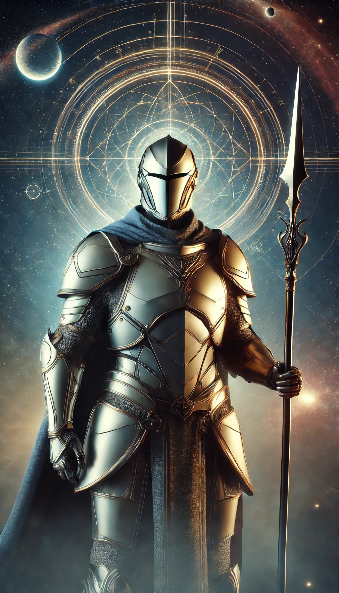

# Aliança da Supernova - Repositório de Quests

## Sobre o Projeto

    

 

Este repositório contém as quests realizadas pela **Aliança da Supernova** no curso de Aprendizado de Máquina do professor **Daniel Cassar**. A **Aliança da Supernova** é composta pelos cavaleiros **Tsuru**, **Pólux**, e **Tiles**, que, após a injustiça sofrida por **Castor**, irmão gêmeo de Pólux, decidiram se rebelar contra a filosofia da **União Total**. Este repositório reflete suas jornadas em busca de uma revolução, em que cada indivíduo é valorizado por suas habilidades únicas.

## Estrutura do Repositório

- `Quests 1`: Início da jornada da Aliança da Supernova, com a resolução de problemas de familiarização com datasets, visualização de dados, normalização e algortimos de classificação.
- `Quests 2`: 

Cada diretório contém os scripts, códigos, e arquivos necessários para a resolução das quests.

## Personagens Principais

    
    

        <h3>Tsuru</h3>
        
Cavaleiro da Supernova, especialista em táticas de combate.

    

    
    

        <h3>Pólux</h3>
        
Irmã de Castor, cavaleira exímia que luta por um sistema mais justo e igualitário.

    

    
    

        <h3>Tiles</h3>
        
Mestre estrategista e defensor das ideias revolucionárias, aliado de Tsuru e Pólux.

    

## Filosofia da Aliança

A **Aliança da Supernova** busca a reestruturação da organização dos cavaleiros no império, para que cada um possa usar suas habilidades únicas de forma eficaz e satisfatória para a proteção de **Lumi**.